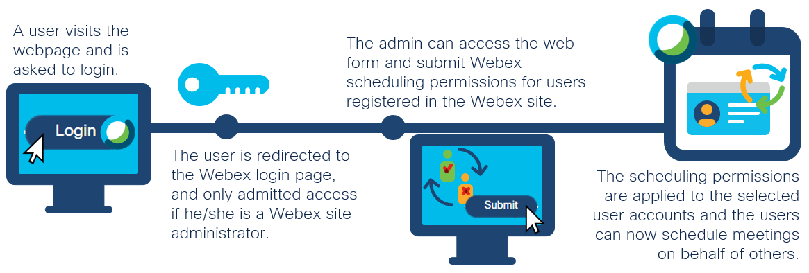
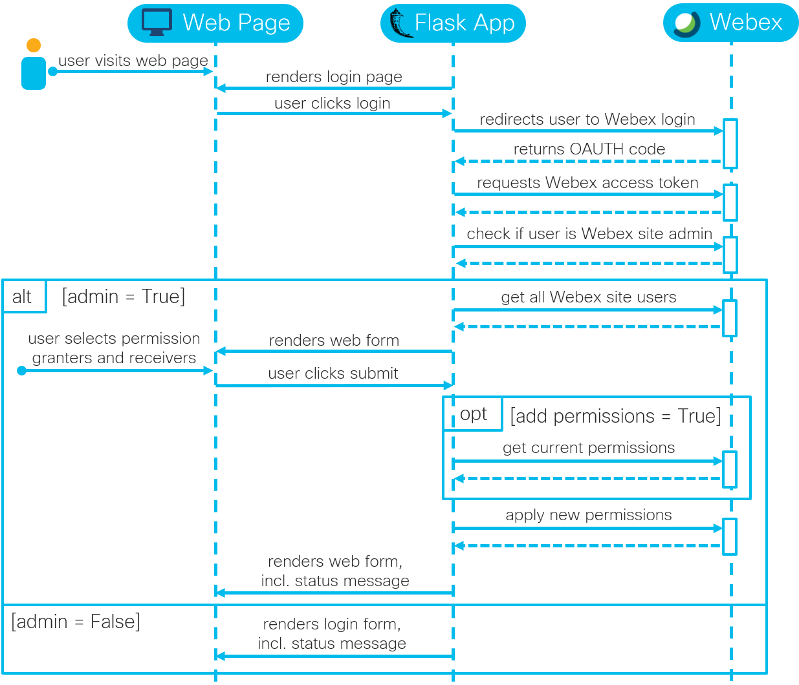

# Changing Webex Meetings Scheduling Permissions

An application to change Webex Meetings scheduling permissions for other users as Webex Meetings Site admin ([watch demo](https://youtu.be/F9FQuZQDmog)).

## Overview
 

**Webex Meetings and Scheduling Permissions**: In this application, [Webex Meeting scheduling permissions](https://help.webex.com/en-us/nub7z8c/Allow-Another-Host-to-Schedule-Meetings-or-Training-Sessions-on-Your-Behalf) can be changed for users in a Webex Meetings site by a site administrator instead of by the permission granter himself/herself by assigning delegates [follwoing these stepss](https://help.webex.com/en-us/nkyeiue/Allow-Someone-to-Schedule-Webex-Meetings-on-Your-Behalf-in-Microsoft-Outlook-for-Windows). For example, when John ("permission receiver") is supposed to be able to schedule meetings on behalf of Janette ("permission granter"), Julia ("site administrator") is now able to add this permission using this web application. Once submitted, John can now schedule meetings on behalf of Janette and make her the host of that meeting as if Janette added the permission herself. 

**Web Page**: The user uses a simple web page to login to Webex to retrieve the right privileges and to get a list of all Webex site users. Once logged in, he/she can select "permission granters" and "permission receivers". The user has thereby the choice to either overwrite existing scheduling permissions of the "permission granter" or to add to the list of existing ones. 

**Flask**: The application is written in Python using the micro web framework Flask. The web server that is part of Flask should not be used in production. 

### Sequence Diagram:

## Contacts
* Jara Osterfeld (josterfe@cisco.com)

## Solution Components
* Webex, incl. the REST API and Meetings XML API
* Flask
* Python

## Prerequisites
- **Webex Meetings**: 
   - **Account**: A Webex Meetings account with SSO authentication is required.
   - **SSO Integration**: If you have admin access to the Webex Control Hub or a sandbox environment, you can enable Single Sign-On authentication following the steps outlined [here](https://help.webex.com/en-us/lfu88u/Single-Sign-On-Integration-in-Cisco-Webex-Control-Hub).
   - **Site**: Note your Webex site name to add to the `credentials.yml` file later as part of the [installation](#Installation). The site name can be found in the Webex URL (https://< site-name >.webex.com/meet) or if you have admin access to the Webex Control Hub, go to *Services* and select *Sites* under the *Meeting* section to see a list of sites configured for your organization.

- **Webex Integration**: Register a Webex OAuth 2 Integration following the steps outlined [here](https://developer.webex.com/docs/integrations), whereby
    - the *Redirect URI* must be set to: http://localhost:5000/webexoauth
    - for the *Scope*, the following value must be selected:
        - spark:all
   - Once registered, note down the *Client ID* and *Client Secret* to add to the `credentials.yml` file later as part of the [installation](#Installation).

- **Webex Meetings Scheduling Permissions**: To be able to schedule meetings on behalf of others, the alternate host must have a host license on your Webex site

## Installation

1. Clone this repository with `git clone <this repo>` and navigate to the directory with `cd directory/to/repo`.

2. (Optional) Create a Python virtual environment and activate it (find instructions [here](https://docs.python.org/3/tutorial/venv.html)).

3. Navigate to the root directory of the repository, and install the requirements with `pip install -r requirements.txt`.

4. Open the `credentials.yml` file, and fill in the required information. If unsure, the [prerequisites](#Prerequisites) chapter outlines where to find the specific values.

5. Set the following environment variable: `set FLASK_APP=main.py`.

6. Start the Flask app with `flask run -p 5000`.

7. In your web browser, navigate to http://localhost:5000/. 

## License
Provided under Cisco Sample Code License, for details see [LICENSE](./LICENSE).

## Code of Conduct
Our code of conduct is available [here](./CODE_OF_CONDUCT.md).

## Contributing
See our contributing guidelines [here](./CONTRIBUTING.md).